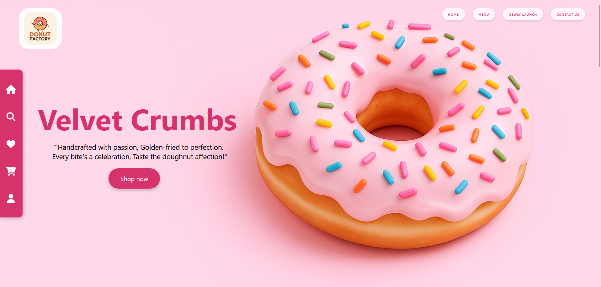
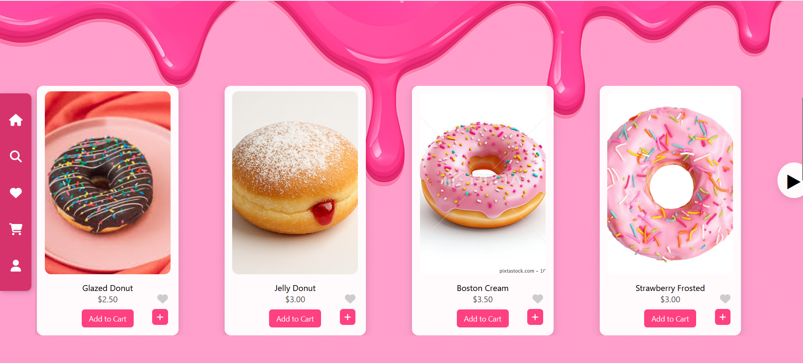
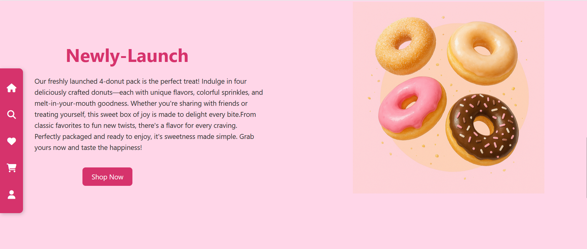
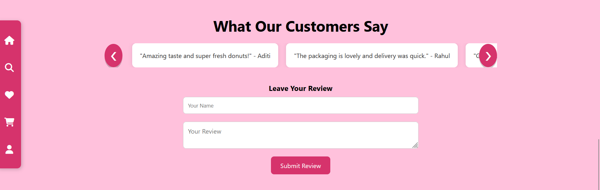
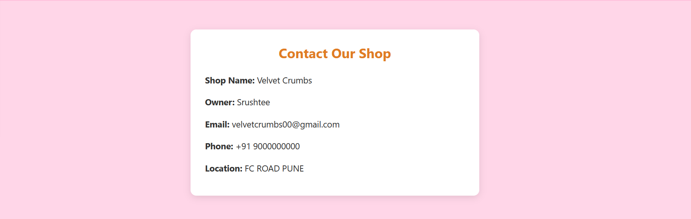

# 🍩 Donut Shopping Website

A visually appealing and responsive Donut Shopping website built using **HTML**, **CSS**, and **JavaScript**. This project showcases a modern e-commerce layout with interactive elements such as:

- 🛒 Add to Cart functionality
- ❤️ Favorite toggle
- 📱 Mobile-responsive design
- 🎨 Stylish UI with animations
- 🧭 Navigation bar and contact section

This project is ideal for anyone looking to understand front-end development and UI interactivity in an e-commerce setting.

## 🚀 Features
- Fully responsive layout
- Smooth animations and transitions
- Organized product cards
- JavaScript-powered cart and like system
- Clean folder structure and reusable components

## 📁 Technologies Used
- HTML5
- CSS3
- JavaScript (ES6)
- 
## 📸 Screenshots

### 🏠 Homepage  

### 🍩 Menu Section  

### ✨ Newly Launched Donuts  

### 💬 Customer Reviews  

### 📞 Contact Us  

